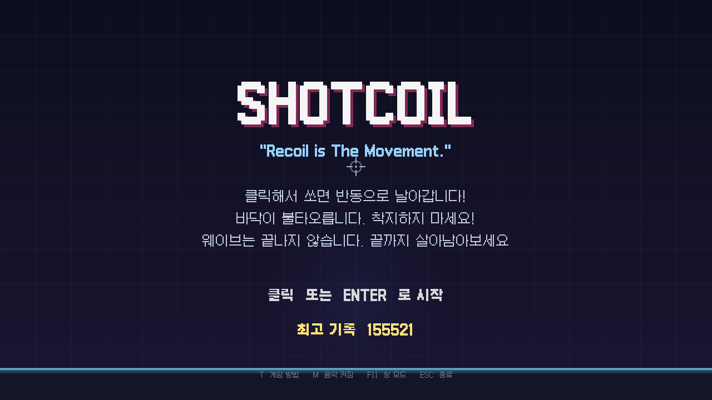
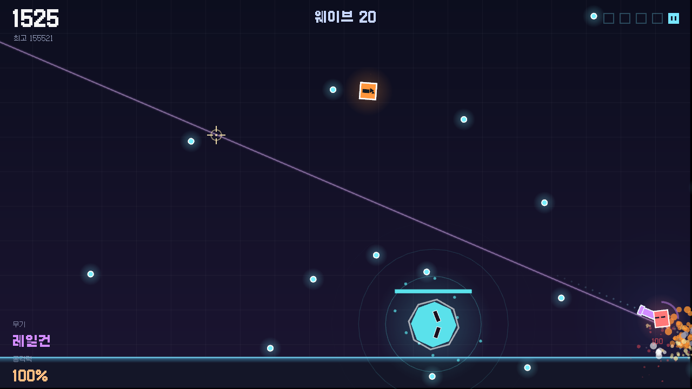
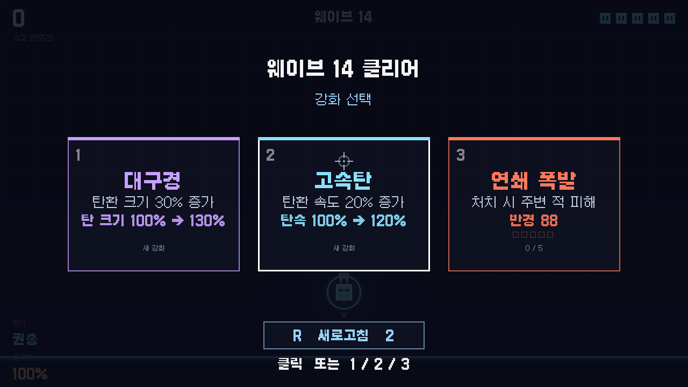

# SHOTCOIL

> **이동 버튼이 없다. 총을 쏘면 그 반동으로 날아간다. 조준이 곧 이동이다.**

[1.44MB GAME DEV CONTEST](https://2pgarcade.com/contest-144mb.html) 출품작.
실행파일 하나, **1,267,200바이트**. 이미지 파일 0개, 오디오 파일 0개, DLL 0개.



---

## 어떤 게임인가

중력은 항상 당신을 끌어내린다. 계속 쏴야 떠 있을 수 있다.

이동과 공격이 **하나의 입력**으로 묶여 있다는 게 전부다. 도망치려 쏜 총알이 적을
맞추고, 적을 맞추려 쏜 총알이 나를 위험한 곳으로 밀어낸다. 이 이중성이 이 게임의
모든 판단을 만든다.

바닥에 오래 서 있으면 지면이 과열되어 타들어간다. 착지는 휴식이 아니라 타이머다.

한 판 2~3분. 죽으면 마찰 없이 즉시 재시작.



---

## 조작

| 입력 | 동작 |
| --- | --- |
| 마우스 이동 | 조준 |
| 좌클릭 | 발사 — 조준한 **반대 방향**으로 반동을 받아 날아간다 (누르면 연사) |
| 1 / 2 / 3 | 웨이브 사이 강화 카드 선택 (클릭으로도 가능) |
| R | 강화 화면에서 카드 새로고침 · 게임 오버 후 재시작 |
| T | 타이틀에서 게임 방법 |
| M | 배경음악 끄기 / 켜기 |
| F11 | 전체화면 / 창 모드 |
| ESC | 타이틀로 / 종료 |

---

## 시스템

**무기 11종** — 권총 · 기관단총 · 검 · 산탄총 · 레일건 · 수류탄 · 바주카포 ·
화염방사기 · 튕김총 · 작살포 · 레이저. 적이 떨어뜨리는 상자로 교체되며, 무기마다
반동 세기와 발사 간격이 달라서 **무기를 바꾸면 나는 방식이 바뀐다.**

**강화 24종** — 웨이브를 클리어할 때마다 3장 중 1장 (보스는 2장). 대부분 무한
중첩되지만, 규칙 자체를 바꾸는 카드에는 상한이 있다. "더 강해지는 것"과 "다른
게임이 되는 것"은 다르기 때문이다.

그중 **특수 증강 8종**은 판당 한 번만 나오고 한 장만 얻을 수 있다. 수치가 아니라
탄환의 규칙을 바꾼다 — 튕길수록 강해지는 `난반사`, 관통할수록 커지는 `포식`,
멀리 날수록 강해지는 `저격`, 오래 떠 있을수록 강해지는 `체공` 등.

**적 8종 + 보스 7종** — 돌진형, 대시형, 분열형, 포탑형, 자폭형, 포격형, 그리고
정면 피격을 막는 방패를 든 실드형. 방패는 당신을 따라 돌지만 **당신이 나는 속도보다
느리게** 돈다 — 체력 덩어리가 아니라 위치 잡기 문제다.

보스는 5웨이브마다, 7종이 순환한다. 뒤쪽 셋은 후반 잡몹의 거대판이라 **보스는
언제나 이미 아는 것이 커진 모습**으로 나온다.

**도전 4종** — 세 웨이브마다 하나씩 얹힌다. 착지 없이 N킬, 무피격 클리어, 제한
시간 안에 N킬, 먼 거리에서 N킬. 무시해도 아무것도 잃지 않기 때문에 **불편한 것을
요구할 수 있다** — 90초 동안 평소와 다르게 날게 만드는 게 목적이다.

**변칙 웨이브 10종** — 웨이브 8부터, 선택이 아니라 강제로 얹히는 규칙 변경.
적 이동 ×1.4, 적 공격속도 ×1.5, 피해 30% 무효, 접촉 피해 2배, 중력 ×1.35 …
후반에 계속 움직이는 변수가 적 체력 하나뿐이 되지 않도록 하는 장치다.



---

## 1.44MB 안에서

용량 제한이 이 프로젝트의 설계를 대부분 결정했다. 압축 **해제 후** 1,474,560바이트
이하여야 하고, 여기에는 실행파일과 런타임이 전부 포함된다.

| | |
| --- | --- |
| **그래픽** | 이미지 에셋 0개. 전부 도형 + 그라디언트 + 파티클로 그린다 |
| **효과음** | WAV 파일 0개. 사각파/톱니파/사인파를 코드로 합성해 8종 |
| **BGM** | 오디오 파일 0개. NES 4성부(펄스 2 + 삼각파 + 노이즈)를 오디오 스트림에 실시간 렌더링. 두 곡에 **약 6KB** |
| **폰트** | 갈무리 Galmuri11 Regular/Bold를 **실제로 쓰는 글자만** 서브셋해 실행파일에 내장 (335자, 약 69KB) |
| **링크** | raylib 정적 링크 + `/MT`. DLL도 런타임 설치도 필요 없다 |

```
Shotcoil.exe          1,267,200
README.txt                3,144
LICENSE-Galmuri.txt       4,453
합계                  1,274,797  /  1,474,560   (86.5%)
```

30초짜리 얇은 모노 OGG 하나면 남은 여유가 통째로 사라진다. 그래서 소리는 전부
합성한다 — 이게 제약을 우회한 게 아니라, 결과적으로 이 게임의 소리가 됐다.

---

## 빌드

Visual Studio 2022, **x64 전용**.

```powershell
msbuild Project1\Project1.sln /p:Configuration=Release /p:Platform=x64
```

산출물은 `Project1\x64\Release\Shotcoil.exe`.

제출 패키지는 스크립트가 만든다. Release를 리빌드하고, 실행파일·안내문·폰트
라이선스를 모아 **압축 해제 기준** 합계를 1,474,560과 대조한 뒤 zip으로 묶는다.

```powershell
powershell -ExecutionPolicy Bypass -File packaging\make-dist.ps1
```

한글 텍스트를 추가했다면 폰트 서브셋을 다시 만들어야 한다 (빌드가 자동으로 실행하지만,
`fontTools`가 없으면 건너뛴다):

```bash
pip install fonttools
python third_party/make-font.py
```

> ⚠️ raylib는 **vcpkg로 가져오지 말 것.** vcpkg 포트가 `SUPPORT_CUSTOM_FRAME_CONTROL`을
> 켜서 빌드하는 탓에 `EndDrawing()`이 버퍼 스왑을 하지 않아 **화면이 흰색으로 멈춘다.**
> `third_party/build-raylib.ps1`로 정적 빌드한 것을 쓴다. 자세한 내용은 `CLAUDE.md` 참고.

Debug 빌드에는 화면을 PNG로 뽑는 캡처 모드와 곡을 wav로 뽑는 플래그가 들어 있다
(제출용 Release에는 코드조차 남지 않는다). 사용법은 `CLAUDE.md` §10-2, §10-3.

---

## 크레딧

- 제작: Lee Siwoo
- 엔진: [raylib](https://www.raylib.com/) — zlib/libpng License
- 폰트: Galmuri11 © 2019–2025 Lee Minseo (quiple) — SIL Open Font License 1.1
  (`third_party/fonts/OFL.txt`, 배포본에 `LICENSE-Galmuri.txt`로 동봉)
